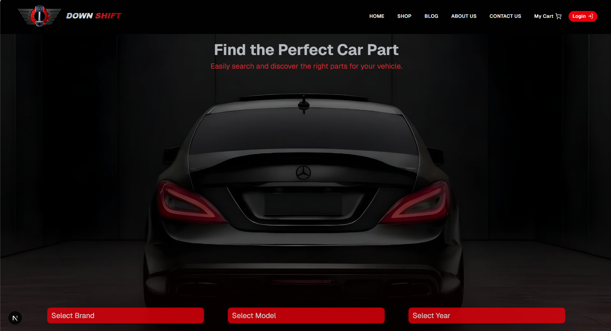
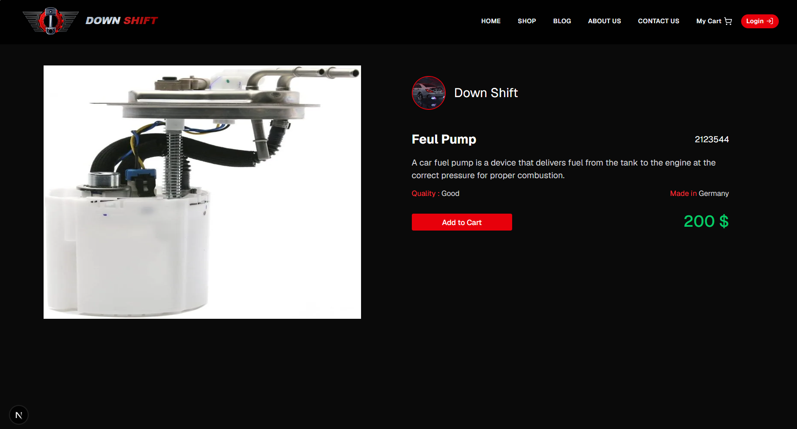
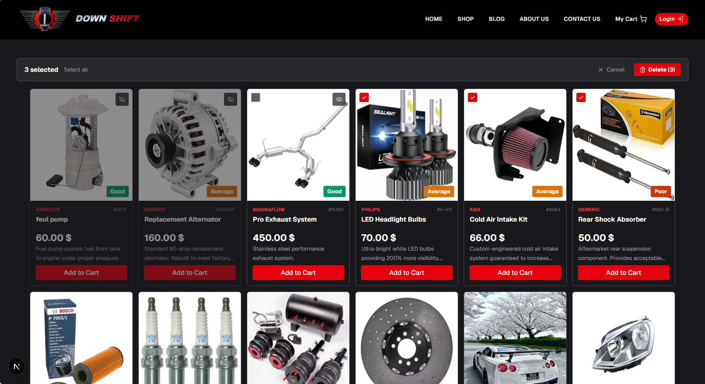
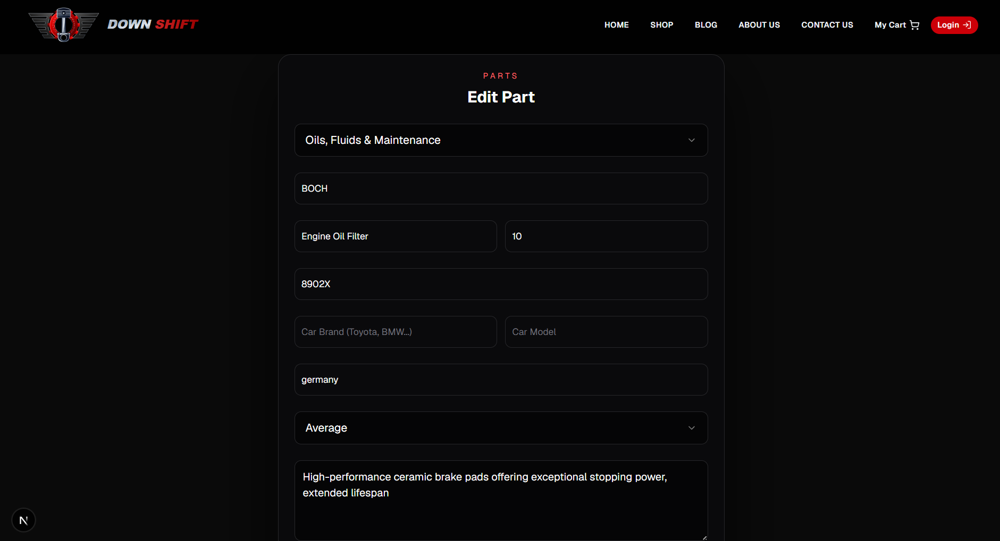

# Origin Part (AutoParts Marketplace)


A full-stack e-commerce platform for buying and selling car parts,  
built with Next.js 14 App Router, PostgreSQL, and Prisma ORM.

> 🚧 **Actively in development** — core features (auth, dashboard, cart, image pipeline) are working; search/filtering is the current focus.

I built this to go beyond basic CRUD and practice the patterns real e-commerce apps need — role-based dashboards, cloud image lifecycle management, and cart state that survives login. It's part of my developer portfolio.

---

## Table of Contents
- [Highlights](#highlights)
- [Screenshots](#screenshots)
- [Tech Stack](#tech-stack)
- [Features](#features)
- [Database Schema](#database-schema)
- [Project Structure](#project-structure)
- [Getting Started](#getting-started)
- [What I Learned](#what-i-learned)
- [Contact](#contact)

---

## Highlights

- **Image lifecycle consistency** (the hardest part of this project): uploading, replacing, and deleting a part's image touches both Cloudinary and PostgreSQL. I handled the failure cases directly — a failed DB write after a successful upload doesn't leave an orphaned Cloudinary file, and a failed Cloudinary delete doesn't leave a part pointing at a missing image. Every step in the chain is checked so a part and its image can never silently drift out of sync.
- **Guest → authenticated cart merge:** cart persists for guests and merges automatically into the DB-backed cart on login, with no item loss or duplication.
- **Debounced search filtered at the DB level *(in progress)*:** search queries will hit PostgreSQL through Prisma rather than filtering an already-fetched list.
- **Bulk seller actions:** select multiple parts and hide/delete them in one action from the dashboard.

---

## Screenshots







---

## Tech Stack

| Layer | Technology |
|---|---|
| **Frontend** | Next.js 14 (App Router), React, TypeScript, Tailwind CSS, shadcn/ui |
| **Backend** | Next.js API Routes, NextAuth.js |
| **Database** | PostgreSQL, Prisma ORM |
| **Storage** | Cloudinary (image upload & lifecycle management) |
| **Auth** | NextAuth.js with role-based access (Buyer / Seller) |

---

## Features

### 🛍️ Buyer
- Browse car parts by category
- 🚧 Search parts by name with debounced suggestions (in progress)
- Part details page with image gallery
- Add to cart (guest cart + persistent cart for logged-in users)
- Guest cart merges automatically on login

### 🏪 Seller Dashboard
- Publish, edit, and delete parts with image upload via Cloudinary
- Toggle part visibility (show / hide from public listing)
- Bulk select and delete multiple parts at once
- Manage store profile

### ⚙️ System
- Role-based authentication (Buyer / Seller)
- Protected routes via Next.js Middleware
- Full image lifecycle handling — upload, replace, and delete, with orphaned-asset cleanup and error handling at every step
- Fully typed with TypeScript

---

## Database Schema



**Key models:** `User`, `Part`, `Category`, `Cart`, `CartItem`, `Image`, `OrphanedAsset`

See [prisma/schema.prisma](./prisma/schema.prisma) for the full schema.

---

## Project Structure

```text
├── app/
│   ├── (auth)/          # Login & Signup pages
│   ├── (public)/        # Home page & part details [id]
│   ├── api/             # API routes (auth, cart, parts, cloudinary)
│   └── dashboard/       # Seller dashboard (part management)
├── components/
│   ├── dashboard/       # Seller management components
│   ├── partDetails/     # Part page with image swap gallery
│   ├── cart/            # Cart drawer
│   ├── auth/            # Sign in / Sign up forms
│   └── ui/              # Shared UI components (shadcn/ui)
└── prisma/
    ├── schema.prisma    # Database schema
    ├── migrations/      # Migration history
    └── ERD.svg          # Entity relationship diagram
```

---

## Getting Started

```bash
# 1. Clone the repository
git clone https://github.com/your-username/your-repo.git
cd your-repo

# 2. Install dependencies
npm install

# 3. Configure environment variables
# Copy .env.example to .env and fill in your values:
# DATABASE_URL=
# NEXTAUTH_SECRET=
# NEXTAUTH_URL=
# CLOUDINARY_CLOUD_NAME=
# CLOUDINARY_API_KEY=
# CLOUDINARY_API_SECRET=

# 4. Run database migrations
npx prisma migrate dev

# 5. Start the development server
npm run dev
```

---

## What I Learned

- Handling a multi-step, multi-service operation (DB + Cloudinary) so it fails safely instead of leaving orphaned files or broken references.
- Structuring a multi-role app with Next.js App Router and Middleware.
- Managing guest carts and merging them automatically on authentication.
- Designing relational schemas and writing incremental migrations with Prisma.
- Building a debounced search system connected to a filtered PostgreSQL query.

---

## Contact

**Mohammad Raiee**  
[LinkedIn](https://linkedin.com/in/yourprofile) · [GitHub](https://github.com/your-usgername) · [mohammadraiee@gmail.com](mailto:your.emae.com)
